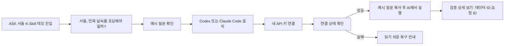

# K-Skill 데모 사용자 중심 재구성 설계

## 한 줄 목적

기존 설치·검증 데모를 유지하면서, 첫 방문자가 `무엇을 할 수 있는지 → 어떻게 시작하는지 → 왜 믿을 수 있는지`를 순서대로 이해하게 한다.

## 배경과 문제

현재 첫 문구는 `ASK 서울의 실제 publication을 읽어 자연어 질문에 답합니다.`이다. `publication`, `readiness`, `bundle`, `row_count`는 구현·검증 용어라서 일반 방문자가 자신의 행동과 결과를 연결하기 어렵다. 실제 채팅 기능이 이 페이지에 있는 것은 아니므로, 마치 페이지에서 곧바로 답변을 받는 것처럼 보이게 하는 것도 피해야 한다.

## 변경하지 않는 경계

- `/skill/v1` 요청 순서, `registration_ready` gate, row-count 검사, request ID 수집은 바꾸지 않는다.
- API Key는 비밀번호 입력창과 현재 탭의 JavaScript 메모리에만 두며, 저장·로그·복사 명령에 넣지 않는다.
- 이 페이지는 Codex·Claude Code에 설치한 skill을 시작시키는 안내 화면이며, 인페이지 챗봇을 새로 만들지 않는다.
- 기존 ASK: SEOUL 공통 네비게이션, 테마 토큰, light/dark mode를 그대로 사용한다.

## 선택지와 결정

| 선택지 | 장점 | 한계 |
| --- | --- | --- |
| 카피만 교체 | 구현이 가장 작다 | 검증 정보가 여전히 첫 행동을 가린다 |
| **사용자 흐름 우선 + 검증 상세 접기** | 목적과 첫 행동이 분명하고 신뢰 근거도 보존한다 | 정적 HTML 구조를 조금 재배치해야 한다 |
| 인페이지 챗봇 추가 | 가장 직접적인 체험 | 현재 데모의 범위·인증 경계·백엔드 변경을 넓힌다 |

두 번째 방식을 적용한다.

## 사용자 흐름

## Figma-ready 화면 명세

직접 Figma 캔버스를 수정하지 못하는 환경이므로, 다음 프레임·전환·문구를 Figma에 그대로 옮길 수 있는 handoff로 남긴다.

### Frame 01 — 기본 화면

- **Desktop:** 1440px wide, 공통 header + page header + 한 열 작업 흐름.
- **Mobile:** 390px wide, 같은 순서를 세로로 유지한다.
- **제목:** `서울, 언제 날씨를 조심해야 할까?`
- **설명:** `서울 행정동 이름으로 물어보면, 더위·비·강풍에 주의할 시간대를 알려드려요.`
- **정확성 문구:** `Codex 또는 Claude Code에 이 기능을 설치해 사용해 보세요.`
- **진행 표시:** 처음에는 `1. AI에 설치하기 → 2. 내 API 키 연결 → 3. 연결 상태 확인`을 보이고, 확인 성공 뒤 `4. AI에 질문하기`를 노출한다.

### Frame 02 — 설치

- 제목: `AI에서 사용 준비하기`
- 설명: `Codex 또는 Claude Code에 한 번 설치하면, 동네 이름으로 날씨 위험 시간을 물어볼 수 있어요.`
- 각 설치 명령의 복사 버튼은 유지한다.
- commit archive와 standalone artifact라는 구현 설명은 `설치 정보 보기` details 안으로 이동한다.

### Frame 03 — API Key와 연결 상태

- 제목: `내 API 키 연결하기`
- 설명: `ASK 서울에서 발급한 내 API 키를 입력하세요. 이 키는 현재 화면에서만 사용돼요.`
- `Marketplace API Key` 라벨은 `내 API 키`로 바꾸고, 기존 발급 링크는 유지한다.
- 제목: `연결 상태 확인하기`
- 설명: `날씨 데이터가 정상적으로 준비되어 있는지 확인합니다.`
- 기본 버튼: `연결 상태 확인`

### Frame 04 — 성공

- 제목: `이제 AI에 이렇게 물어보세요`
- 설명: `질문을 복사해 설치한 Codex 또는 Claude Code에 붙여넣으세요.`
- 예시: `성수2가3동의 이번 주 기상 위험 시간대를 알려줘.`
- 주의: `이 정보는 예보를 바탕으로 한 참고용 위험 시간대이며, 기상청 공식 특보를 대신하지 않습니다.`

### Frame 05 — 검증 상세 (접힌 기본 상태)

- 토글 제목: `데이터·검증 정보 보기`
- 내용: 데이터 게시 ID, 조회된 행 수, 각 요청 ID 및 bundle/product/data 통과 근거.
- 이 영역은 일반 사용자의 첫 읽기 흐름을 방해하지 않으며, 시연·리뷰어에게는 동일한 증거를 제공한다.

## 카피 원칙

- 화면 앞부분은 `서울`, `행정동`, `주의할 시간`, `AI에 물어보기`, `연결 상태`처럼 서비스 범위와 행동·결과를 말한다.
- `publication`, `readiness`, `bundle`, `row_count`, `request_id`는 검증 상세에서만 쓴다.
- `실시간`, `공식 특보`, `페이지 안에서 바로 답변`처럼 사실보다 넓은 약속은 하지 않는다.

## 검증 기준

1. API Key의 저장 금지와 three-request gate 테스트가 계속 통과한다.
2. 새 카피와 details 기반 정보 구조를 정적 테스트로 고정한다.
3. `npm test`와 local page의 desktop·mobile 반응형 점검을 통과한다.
4. light/dark mode에서 공통 토큰 외의 개인 색상을 추가하지 않는다.
